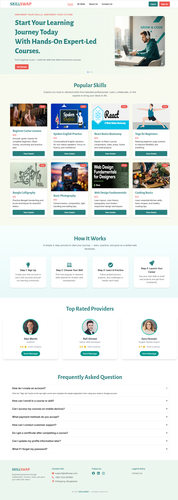
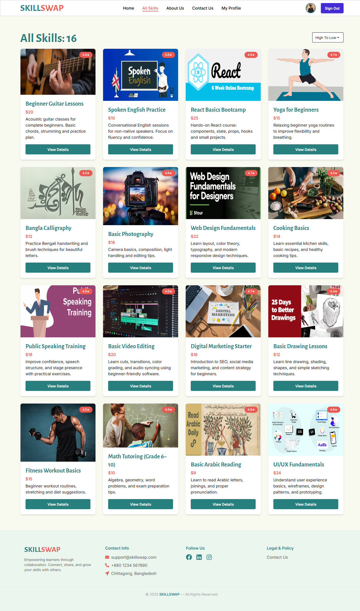
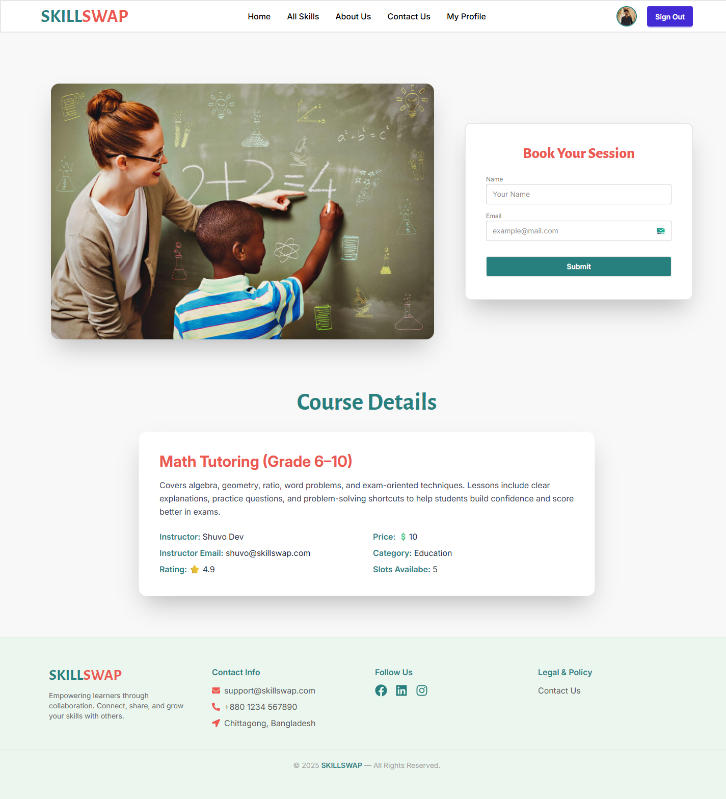

# 🚀 SkillSwap

A modern platform to explore skills, learn from professionals, and book personalized learning sessions.

---

## 📌 Overview

**SkillSwap** is an online learning & skill-booking platform where users can browse popular skills, view expert providers, read details, and book one-to-one sessions.  
The platform focuses on a **clean UI**, **responsive design**, **smooth animations**, and **user-friendly experience** across all devices.

---

## ❗ Problem Statement

Many learners struggle to find skilled professionals quickly and reliably.  
SkillSwap solves this by providing a centralized place where users can explore trending skills, view expert ratings, read details, and instantly book sessions.  
It simplifies the learning journey and connects learners with top-rated professionals in an easy way.

---

## 🛠️ Tools & Technologies Used

### **Frontend**

- React
- React Router
- TailwindCSS
- Swiper
- AOS (Animate On Scroll)
- React Icons
- React Hot Toast
- React Spinners

### **Backend**

> This project uses Firebase Authentication & real-time data (no custom backend).

### **Other**

- Firebase Authentication
- Vite
- Deployment: Firebase Hosting

---

## 🔧 Methods / Development Approach

- Designed a fully responsive UI with **React + TailwindCSS**
- Implemented page navigation using **React Router**
- Added scroll animations using **AOS**
- Created reusable components for maintainability
- Used **Firebase Authentication** for login, signup & forgot password
- Implemented success toast notifications using **react-hot-toast**
- Used **Swiper** for Hero Slider
- Deployed the project on **Firebase Hosting**

---

## ⭐ Key Features

- 🔐 **Authentication:** Login, Signup & Forgot Password using Firebase
- 🎠 **Hero Slider:** Attractive carousel built with Swiper
- 📚 **Popular Skills:** Cards with images, ratings and pricing
- 📄 **Skill Details Page:** Complete details with booking form
- 🧑‍🏫 **Top Rated Providers:** Shows professional trainers
- ❓ **FAQ Section:** Helps users understand the platform
- 📱 **Fully Responsive:** Works perfectly on all devices
- 🎞️ **AOS Animations:** Smooth scroll-based animations
- 🔔 **Toast Notifications:** Success & info alerts
- ⏳ **Loading Spinners:** Beautiful loaders with React Spinners

---

## 📸 Screenshots / Demo

### **Home Page**



### **All Skills Page**



### **Skill Details Page**



---

## 🚀 How to Run This Project

### 1️⃣ Clone the repository

```bash
git clone https://github.com/yourname/skillswap.git

Install dependencies
npm install

3️⃣ Setup Environment Variables

Create a .env file inside the project root:

VITE_apiKey=your_firebase_api_key
VITE_authDomain=your_firebase_auth_domain
VITE_projectId=your_project_id
VITE_storageBucket=your_storage_bucket
VITE_messagingSenderId=your_sender_id
VITE_appId=your_app_id

4️⃣ Start the development server
npm run dev

5️⃣ Open in browser
http://localhost:5173/

```
